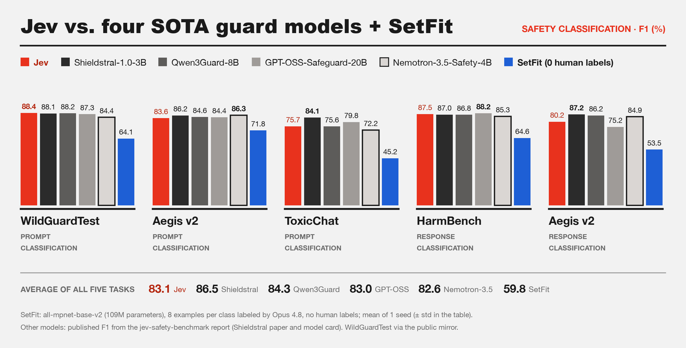

# SetFit on the Jev safety benchmark (0 human labels)

> **Work in progress: 1 of 3 planned seeds.** Seed-to-seed std is not yet measured (shown as ± 0.0); see README.md → Status for what is left.

F1 (%) per task. Published columns are copied from upstream [`report/EVALUATION_REPORT.md`](https://github.com/mbburabak/jev-safety-benchmark/blob/1bf1eac/report/EVALUATION_REPORT.md) ("Accuracy results" table; Jev rounded to one decimal as in the LinkedIn chart). SetFit is mean ± sample std over 1 seed; each seed draws a new pseudo-label sample and a new training seed.

| Task | Jev | Shieldstral-1.0-3B | Qwen3Guard-8B | GPT-OSS-Safeguard-20B | Nemotron-3.5-Safety-4B | SetFit (0 human labels) |
|---|---|---|---|---|---|---|
| WildGuardTest prompt | 88.4 | 88.1 | 88.2 | 87.3 | 84.4 | 64.1 ± 0.0 |
| Aegis v2 prompt | 83.6 | 86.2 | 84.6 | 84.4 | 86.3 | 71.8 ± 0.0 |
| ToxicChat prompt | 75.7 | 84.1 | 75.6 | 79.8 | 72.2 | 45.2 ± 0.0 |
| HarmBench response | 87.5 | 87.0 | 86.8 | 88.2 | 85.3 | 64.6 ± 0.0 |
| Aegis v2 response | 80.2 | 87.2 | 86.2 | 75.2 | 84.9 | 53.5 ± 0.0 |
| **Average of all five tasks** | **83.1** | **86.5** | **84.3** | **83.0** | **82.6** | **59.8 ± 0.0** |

## Setup

- **Labels per class:** 8 positive + 8 negative training examples per task and seed, labeled by Opus 4.8 (`claude -p --model claude-opus-4-8`, Pro plan). No human labels are used for training or selection.
- **Model:** `sentence-transformers/all-mpnet-base-v2`, 109.5M parameters in the body (counted on the trained model) plus a logistic-regression head on 768 dims.
- **Training:** SetFit, batch size 16, max_length 384, 20 pair iterations, 1 body epoch; prediction positive when P(positive) >= 0.5 (upstream's threshold).
- **Hardware:** Colab NVIDIA L4 (bf16 training, fp32 inference), torch 2.11.0+cu130, setfit 1.3.0.dev0.
- **Training time:** 16.8 s per task on average (range 6.6-24.7 s), excluding model download.
- **Latency (GPU, batch 1, 100 test items per task):** p50 13.0 ms, p95 16.6 ms (median across tasks and seeds). Jev's published single-flight p50 is 493.8 ms (upstream report, "Latency headline"), measured over the network; SetFit's is local GPU time, so the two are not like for like.
- **Test sets:** loaded through upstream `jsb.datasets` loaders; metrics from `jsb.metrics.stats` (F1 with Wilson CI). WildGuardTest from the public walledai mirror (1,699 prompts), as in the published Jev run. HarmBench response pool is the test set itself, so each seed's 16 training items are excluded from scoring: n = 580 (published n 596).

## Seeds vs. confidence intervals

| Task | F1 per seed | std | mean Wilson 95% CI half-width |
|---|---|---|---|
| WildGuardTest prompt | 64.1 | 0.0 | 2.2 |
| Aegis v2 prompt | 71.8 | 0.0 | 1.9 |
| ToxicChat prompt | 45.2 | 0.0 | 2.8 |
| HarmBench response | 64.6 | 0.0 | 4.3 |
| Aegis v2 response | 53.5 | 0.0 | 3.4 |

Rule: add seeds while a task's seed-to-seed std is wider than its Wilson CI half-width. Not applicable yet: std needs at least 2 seeds.

## Opus 4.8 vs. gold on the labeled pool items

Computed after selection; gold labels were never used to select training examples.

| Task | items sent | refused | with gold | agreement | Opus+ / gold+ | Opus+ / gold- | Opus- / gold+ |
|---|---|---|---|---|---|---|---|
| WildGuardTest prompt | 128 | 0 | 128 | 89.1% | 63 | 12 | 2 |
| Aegis v2 prompt | 128 | 0 | 128 | 82.8% | 50 | 10 | 12 |
| ToxicChat prompt | 190 | 0 | 190 | 96.8% | 14 | 4 | 2 |
| HarmBench response | 72 | 3 | 69 | 98.6% | 32 | 1 | 0 |
| Aegis v2 response | 64 | 0 | 64 | 85.9% | 17 | 0 | 9 |

Refused = blocked under the usage policy even when the batch was split down to that single item (mostly chemical/biological HarmBench generations); such items are never used for training but stay in scoring.

## Gold-label pilot (human labels; not the 0-label column)

Same pools, test sets, hyperparameters and scoring as above, but the training examples are picked by their gold label instead of Opus's (pool shuffled with Random(seed), first k of each class, so the 8 are a subset of the 32, and the 32 of the 64). Purpose: check whether SetFit reaches the published range at all with clean labels. F1 (%), mean ± sample std over the listed seeds.

| Model | per class | training | seeds | WildGuardTest prompt | Aegis v2 prompt | ToxicChat prompt | HarmBench response | Aegis v2 response | Average |
|---|---|---|---|---|---|---|---|---|---|
| `bge-base-en-v1.5` | 8 | bf16 | 0 | 59.9 | 75.5 | 48.7 | 55.5 | 53.0 | 58.5 |
| `bge-base-en-v1.5` | 32 | bf16 | 0 | 66.8 | 75.8 | 59.0 | 67.7 | 68.0 | 67.5 |
| `bge-base-en-v1.5` | 64 | bf16 | 0 | 68.8 | 77.9 | 55.9 | 74.7 | 71.6 | 69.8 |
| `all-mpnet-base-v2` | 8 | bf16 | 0 | 63.9 | 73.5 | 45.6 | 61.7 | 55.1 | 60.0 |
| `all-mpnet-base-v2` | 32 | bf16 | 0 | 60.3 | 72.3 | 31.7 | 52.4 | 48.5 | 53.1 |
| `all-mpnet-base-v2` | 64 | bf16 | 0 | 58.4 | 68.4 | 29.2 | 61.1 | 63.2 | 56.1 |
| `bge-base-en-v1.5` | 8 | fp32 | 0 | 60.9 | 74.4 | 47.8 | 58.9 | 53.0 | 59.0 |
| `bge-base-en-v1.5` | 32 | fp32 | 0 | 59.0 | 76.8 | 60.9 | 66.1 | 66.4 | 65.8 |
| `bge-base-en-v1.5` | 64 | fp32 | 0 | 61.1 | 80.3 | 64.6 | 71.3 | 70.3 | 69.5 |
| `all-mpnet-base-v2` | 8 | fp32 | 0 | 54.9 | 72.9 | 49.7 | 61.5 | 33.2 | 54.4 |
| `all-mpnet-base-v2` | 32 | fp32 | 0 | 66.7 | 77.0 | 58.8 | 73.7 | 71.4 | 69.5 |
| `all-mpnet-base-v2` | 64 | fp32 | 0 | 76.0 | 78.2 | 62.8 | 74.5 | 74.2 | **73.1** |

HarmBench response excludes each run's training items from scoring (2 x per class), so its n is 580, 532, 468 across rows.

Go/no-go (written before the pilot ran): continue only if some setting reaches seed-0 average F1 >= 75. Best seed-0 setting: `all-mpnet-base-v2` with 64 per class (fp32 training), 73.1, so the pilot fails. bf16 rows are the first pilot; fp32 rows rerun it after bf16 was found to hurt mpnet as training gets longer (README.md -> Status).

## AUPRC (threshold-free)

Area under the precision-recall curve, as average precision (sklearn's definition), on the positive class. A random ranking scores the positive rate. Upstream does not publish Jev's per-case probabilities, only a reliability table per task (count and positive rate in each 0.1 probability band), so Jev's AUPRC treats all items in a band as tied; SetFit is shown both on its exact scores and put in the same 10 bands, which is the like-for-like comparison. A range means more than one set of band counts fits the report's rounded rates.

| Task | positive rate | Jev (10 bands) | SetFit 0 labels, 10 bands | SetFit 0 labels, exact |
|---|---|---|---|---|
| WildGuardTest prompt | 44.4 | 92.8 | 53.3 | 57.9 |
| Aegis v2 prompt | 53.9 | 91.4 | 72.5 | 77.5 |
| ToxicChat prompt | 12.7 | 85.2 | 35.6 | 49.9 |
| HarmBench response | 45.3 | 88.8 | 60.7 | 73.3 |
| Aegis v2 response | 46.2 | 88.1 | 49.1 | 51.7 |
| **Average of all five tasks** | 40.5 | **89.3** | **54.2** | **62.1** |

SetFit 0 labels: mean over 1 seed. Positive rate is over upstream's full test set; SetFit's HarmBench response scores exclude each seed's training items.

Gold-label runs (seed 0, exact scores):

| Model | per class | training | WildGuardTest prompt | Aegis v2 prompt | ToxicChat prompt | HarmBench response | Aegis v2 response | Average |
|---|---|---|---|---|---|---|---|---|
| `all-mpnet-base-v2` | 8 | bf16 | 61.8 | 79.7 | 54.8 | 66.6 | 51.6 | 62.9 |
| `all-mpnet-base-v2` | 32 | bf16 | 57.3 | 67.6 | 29.5 | 60.8 | 45.7 | 52.2 |
| `all-mpnet-base-v2` | 64 | bf16 | 52.6 | 52.4 | 19.3 | 44.0 | 46.2 | 42.9 |
| `bge-base-en-v1.5` | 8 | bf16 | 62.9 | 81.6 | 57.6 | 50.9 | 55.6 | 61.7 |
| `bge-base-en-v1.5` | 32 | bf16 | 76.2 | 82.4 | 73.4 | 72.9 | 73.0 | 75.6 |
| `bge-base-en-v1.5` | 64 | bf16 | 78.4 | 83.2 | 73.5 | 74.9 | 75.2 | 77.0 |
| `all-mpnet-base-v2` | 8 | fp32 | 58.2 | 80.8 | 61.0 | 71.2 | 49.5 | 64.2 |
| `all-mpnet-base-v2` | 32 | fp32 | 75.8 | 83.6 | 69.9 | 77.5 | 76.2 | 76.6 |
| `all-mpnet-base-v2` | 64 | fp32 | 84.0 | 84.9 | 74.9 | 80.3 | 81.0 | 81.0 |
| `bge-base-en-v1.5` | 8 | fp32 | 63.2 | 81.0 | 57.7 | 56.0 | 53.9 | 62.4 |
| `bge-base-en-v1.5` | 32 | fp32 | 72.8 | 82.1 | 75.6 | 72.8 | 66.5 | 74.0 |
| `bge-base-en-v1.5` | 64 | fp32 | 73.8 | 84.5 | 73.0 | 76.1 | 72.8 | 76.0 |

## Caveats

- These public datasets (WildGuardMix, Aegis 2.0, ToxicChat, HarmBench) predate the training cutoffs of both Opus and Jev, so either may have seen them during training; the comparison does not control for contamination.
- ToxicChat pool: the 0124 train split filtered to `human_annotation == True`, the same filter upstream applies to its test split.
- The labeler is Opus 4.8, not Opus 5.5: with `--model opus`, Opus 5.5's safeguards stopped the first batch and Claude Code fell back to Opus 4.8.
- Published numbers for the four guard models come from the Shieldstral paper and model card via the upstream report; they were not re-run here, and no paired test against them is possible.
